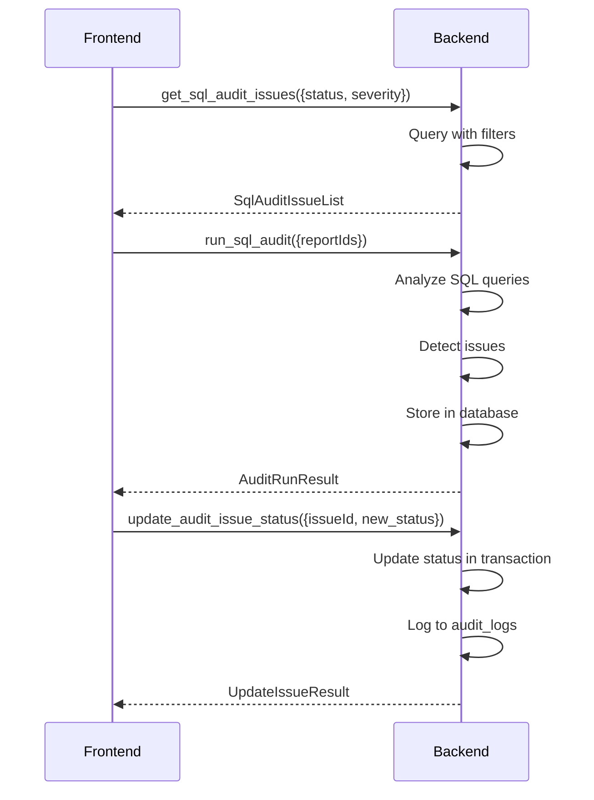

# SQL Audit and Logging IPC Commands

## get_sql_audit_issues

**Description**: Retrieve SQL audit issues detected from WDR reports.

**Input**:
```typescript
{
    reportId?: number;           // Filter by specific report
    status?: AuditStatus;        // Filter by status
    severity?: AuditSeverity;    // Filter by severity
    issueType?: AuditIssueType;  // Filter by issue type
    limit?: number;
    offset?: number;
    sortBy?: 'detected_at' | 'severity' | 'title';
}
```

**Output**: `SqlAuditIssueList`

```typescript
interface SqlAuditIssueList {
    issues: SqlAuditIssue[];
    total: number;
    summary: AuditSummary;
}

interface SqlAuditIssue {
    id: number;
    report_id?: number;
    sql_id?: number;
    issue_type: AuditIssueType;
    severity: AuditSeverity;
    title: string;
    description: string;
    problematic_sql?: string;
    recommendation: string;
    status: AuditStatus;
    detected_at: string;  // ISO 8601
    resolved_at?: string;
    resolved_by?: string;
}

type AuditIssueType =
    | 'FullTableScan'
    | 'MissingIndex'
    | 'InefficientJoin'
    | 'MissingStats'
    | 'ExpensiveFunction'
    | 'CartesianProduct'
    | 'NestedLoopWithIndex'
    | 'HashJoinTooLarge'
    | 'SortOperation';

type AuditSeverity = 'Critical' | 'High' | 'Medium' | 'Low' | 'Info';

type AuditStatus = 'Open' | 'Reviewed' | 'Whitelisted' | 'Fixed' | 'Ignored';

interface AuditSummary {
    total_issues: number;
    by_severity: Record<AuditSeverity, number>;
    by_status: Record<AuditStatus, number>;
    by_type: Record<AuditIssueType, number>;
}
```

**Error Cases**:
- Database error: `String` error message
- Invalid filter parameters: `String` error message

---

## run_sql_audit

**Description**: Run SQL audit analysis on WDR reports.

**Input**:
```typescript
{
    reportIds?: number[];        // Specific reports to audit (optional)
    include_resolved: boolean;   // Re-audit resolved issues
    audit_types?: AuditIssueType[];  // Specific issues to check
}
```

**Output**: `AuditRunResult`

```typescript
interface AuditRunResult {
    success: boolean;
    reports_audited: number;
    new_issues_found: number;
    existing_issues_updated: number;
    issues: SqlAuditIssue[];
    duration_ms: number;
    message?: string;
}
```

**Error Cases**:
- No reports specified and no reports exist: `String` error message
- Database error: `String` error message
- Audit timeout: `String` error message

**Performance**: Must complete within 30 seconds for typical WDR reports.

**Audit Algorithm**:
```rust
async fn run_sql_audit(
    reports: &[i64],
    include_resolved: bool,
    audit_types: &[AuditIssueType]
) -> Result<AuditRunResult, String> {
    // 1. Fetch all SQL from reports
    let sql_queries = fetch_sql_queries(reports, include_resolved).await?;

    // 2. Analyze each SQL
    let mut issues = Vec::new();
    for sql in sql_queries {
        let sql_issues = analyze_sql(&sql).await?;
        issues.extend(sql_issues);
    }

    // 3. Store issues in database
    let (new_count, updated_count) = store_issues(issues).await?;

    Ok(AuditRunResult {
        success: true,
        reports_audited: reports.len(),
        new_issues_found: new_count,
        existing_issues_updated: updated_count,
        issues: load_recent_issues().await?,
        duration_ms: elapsed_time(),
    })
}
```

---

## update_audit_issue_status

**Description**: Update status of an audit issue (mark as reviewed, fixed, whitelisted, etc.).

**Input**:
```typescript
{
    issueId: number;
    new_status: 'Reviewed' | 'Whitelisted' | 'Fixed' | 'Ignored';
    resolution_note?: string;
    resolved_by: string;
}
```

**Output**: `UpdateIssueResult`

```typescript
interface UpdateIssueResult {
    success: boolean;
    issue_id: number;
    old_status: AuditStatus;
    new_status: AuditStatus;
    resolved_at?: string;
    message?: string;
}
```

**Error Cases**:
- Issue not found: `String` error message
- Invalid status transition: `String` error message
- Database error: `String` error message

**Valid Transitions**:
```
Open → Reviewed
Open → Whitelisted
Open → Fixed
Open → Ignored
Reviewed → Fixed
Reviewed → Whitelisted
Reviewed → Ignored
```

**Audit**: This operation is logged to audit_logs table per Constitution Principle IX.

---

## get_audit_issue_detail

**Description**: Get detailed information about a specific audit issue.

**Input**:
```typescript
{
    issueId: number;
}
```

**Output**: `AuditIssueDetail`

```typescript
interface AuditIssueDetail {
    issue: SqlAuditIssue;
    related_sql?: TopSql;
    related_report?: WdrReportSummary;
    similar_issues: SqlAuditIssue[];  // Issues of same type
    optimization_history: OptimizationHistory[];
}

interface OptimizationHistory {
    timestamp: string;
    action: string;
    performed_by: string;
    result: string;
}
```

**Error Cases**:
- Issue not found: `String` error message
- Database error: `String` error message

---

## bulk_update_audit_issues

**Description**: Update status of multiple audit issues at once.

**Input**:
```typescript
{
    issue_ids: number[];
    new_status: 'Reviewed' | 'Whitelisted' | 'Fixed' | 'Ignored';
    resolution_note?: string;
    resolved_by: string;
}
```

**Output**: `BulkUpdateResult`

```typescript
interface BulkUpdateResult {
    success: boolean;
    updated_count: number;
    failed_ids: FailedUpdate[];
    message?: string;
}

interface FailedUpdate {
    issue_id: number;
    error: string;
}
```

**Error Cases**:
- No issues specified: `String` error message
- Database error: `String` error message

**Transaction**: All updates succeed or all fail (atomic operation).

---

## get_audit_logs

**Description**: Retrieve system audit logs for compliance tracking.

**Input**:
```typescript
{
    action?: AuditAction;        // Filter by action type
    user_id?: string;            // Filter by user
    entity_type?: string;        // Filter by entity type
    entity_id?: number;          // Filter by entity ID
    start_date?: string;         // ISO 8601
    end_date?: string;           // ISO 8601
    limit?: number;
    offset?: number;
}
```

**Output**: `AuditLogList`

```typescript
interface AuditLogList {
    logs: AuditLogEntry[];
    total: number;
}

interface AuditLogEntry {
    id: number;
    timestamp: string;  // ISO 8601
    user_id?: string;
    action: AuditAction;
    entity_type: string;
    entity_id?: number;
    old_value?: string;
    new_value?: string;
    ip_address?: string;
    success: boolean;
    error_message?: string;
    details?: string;
}

type AuditAction =
    | 'Create'
    | 'Read'
    | 'Update'
    | 'Delete'
    | 'Import'
    | 'Export'
    | 'Login'
    | 'Logout'
    | 'ThresholdUpdate'
    | 'ReportDelete'
    | 'ConfigurationChange';
```

**Error Cases**:
- Database error: `String` error message
- Invalid date range: `String` error message

---

## export_audit_logs

**Description**: Export audit logs to file for compliance reporting.

**Input**:
```typescript
{
    export_path: string;
    format: 'json' | 'csv' | 'pdf';
    start_date?: string;
    end_date?: string;
    actions?: AuditAction[];
}
```

**Output**: `ExportResult`

```typescript
interface ExportResult {
    success: boolean;
    export_path: string;
    record_count: number;
    file_size: number;
    message?: string;
}
```

**Error Cases**:
- Invalid export path: `String` error message
- Disk space insufficient: `String` error message
- Database error: `String` error message

---

## get_audit_statistics

**Description**: Get audit statistics for dashboard display.

**Input**: None

**Output**: `AuditStatistics`

```typescript
interface AuditStatistics {
    total_audit_entries: number;
    entries_by_action: Record<AuditAction, number>;
    entries_by_day: DailyStat[];
    top_users: UserStat[];
    error_rate: number;  // Percentage of failed actions
    last_audit_entry?: string;
}

interface DailyStat {
    date: string;  // YYYY-MM-DD
    count: number;
    errors: number;
}

interface UserStat {
    user_id: string;
    action_count: number;
    last_action: string;
}
```

---

## Connection Flow



## SQL Audit Detection Rules

### Full Table Scan Detection
```rust
fn detect_full_table_scan(plan: &ExecutionPlanNode) -> Vec<AuditIssue> {
    let mut issues = Vec::new();

    fn check_node(node: &ExecutionPlanNode, parent: Option<&ExecutionPlanNode>) {
        if node.operation == "Seq Scan" {
            let rows = node.rows;
            if rows > get_threshold("full_table_scan_rows") {
                issues.push(AuditIssue {
                    issue_type: AuditIssueType::FullTableScan,
                    severity: if rows > 1000000 { AuditSeverity::Critical }
                             else if rows > 100000 { AuditSeverity::High }
                             else { AuditSeverity::Medium },
                    description: format!("Full table scan on {} rows", rows),
                    recommendation: "Consider creating an index on the filtered column".to_string(),
                });
            }
        }

        for child in &node.children {
            check_node(child, Some(node));
        }
    }

    check_node(plan, None);
    issues
}
```

### Missing Index Detection
```rust
fn detect_missing_index(sql: &str, plan: &ExecutionPlanNode) -> Vec<AuditIssue> {
    let mut issues = Vec::new();

    // Check for WHERE clause columns without indexes
    if has_where_clause(sql) {
        let where_columns = extract_where_columns(sql);
        let table_name = extract_main_table(sql);

        if !has_index_on_columns(&table_name, &where_columns) {
            issues.push(AuditIssue {
                issue_type: AuditIssueType::MissingIndex,
                severity: AuditSeverity::High,
                description: format!("WHERE clause columns may benefit from index"),
                recommendation: format!("CREATE INDEX idx_{} ON {}({})",
                    table_name, table_name, where_columns.join(", ")),
            });
        }
    }

    issues
}
```

### Inefficient Join Detection
```rust
fn detect_inefficient_join(plan: &ExecutionPlanNode) -> Vec<AuditIssue> {
    let mut issues = Vec::new();

    if plan.operation == "Nested Loop" {
        let outer_rows = plan.rows;
        let inner_cost = plan.children[0].cost;

        if outer_rows > 10000 && inner_cost > 1000 {
            issues.push(AuditIssue {
                issue_type: AuditIssueType::NestedLoopWithIndex,
                severity: AuditSeverity::Medium,
                description: "Nested loop join may be inefficient for large datasets".to_string(),
                recommendation: "Consider hash join or adding indexes".to_string(),
            });
        }
    }

    for child in &plan.children {
        issues.extend(detect_inefficient_join(child));
    }

    issues
}
```

## Performance Considerations

### Database Indexes
```sql
CREATE INDEX idx_audit_issues_report ON sql_audit_issues(report_id);
CREATE INDEX idx_audit_issues_status ON sql_audit_issues(status);
CREATE INDEX idx_audit_issues_severity ON sql_audit_issues(severity);
CREATE INDEX idx_audit_logs_timestamp ON audit_logs(timestamp);
CREATE INDEX idx_audit_logs_action ON audit_logs(action);
```

### Caching
- Cache audit statistics for 5 minutes
- Cache issue counts for 1 minute
- Invalidate on issue status changes

### Batch Processing
- Process SQL audit in batches of 100 queries
- Use parallel processing for multiple reports
- Report progress every 2 seconds
- Allow cancellation of long-running audits

## Compliance Requirements

Per Constitution Principle IX, audit logs must track:

### Mandatory Audit Events
1. Threshold configuration changes
2. WDR report deletions
3. Audit issue status changes
4. Configuration changes
5. Import/export operations
6. User logins (if applicable)

### Audit Log Format
```sql
CREATE TABLE audit_logs (
    id INTEGER PRIMARY KEY AUTOINCREMENT,
    timestamp DATETIME NOT NULL DEFAULT CURRENT_TIMESTAMP,
    user_id TEXT,
    action TEXT NOT NULL,
    entity_type TEXT NOT NULL,
    entity_id INTEGER,
    old_value TEXT,
    new_value TEXT,
    ip_address TEXT,
    success BOOLEAN NOT NULL,
    error_message TEXT,
    details TEXT
);
```

### Retention Policy
- Audit logs: Retain for 2 years
- Audit issues: Retain until marked as Fixed
- Deleted reports: Log deletion but remove data after 30 days

## Error Handling

**Audit Run Errors**:
- Database timeout: Return partial results with warning
- Out of memory: Process in smaller batches
- Invalid report: Skip and continue
- Parser error: Log error but continue with other SQL

**Status Update Errors**:
- Invalid transition: Return error with valid transitions
- Concurrent update: Detect and retry
- Permission denied: Clear error message

All errors logged to console and optionally to audit_logs with action='Error'.
