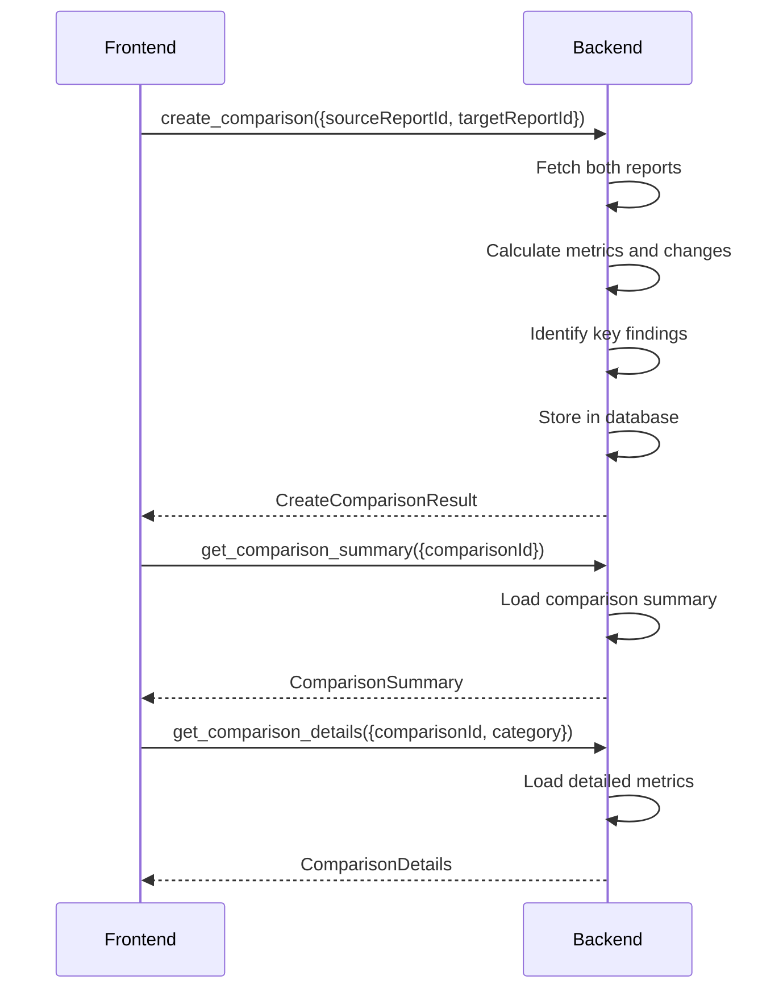

# WDR Report Comparison IPC Commands

## get_comparisons

**Description**: Retrieve all saved comparison analyses.

**Input**:
```typescript
{
    limit?: number;             // Maximum number of results
    offset?: number;            // Offset for pagination
    sortBy?: 'created_at' | 'performance_score_change';
    sortOrder?: 'asc' | 'desc';
}
```

**Output**: `ComparisonListResponse`

```typescript
interface ComparisonListResponse {
    comparisons: WdrComparison[];
    total: number;
}

interface WdrComparison {
    id: number;
    source_report_id: number;
    target_report_id: number;
    source_instance: string;
    target_instance: string;
    created_at: string;  // ISO 8601
    comparison_type: 'TimeBased' | 'InstanceBased' | 'AdHoc';
    performance_score_change: number;  // -100 to +100
    status: 'Improved' | 'Degraded' | 'NoSignificantChange';
}
```

**Error Cases**:
- Database error: `String` error message
- Invalid parameters: `String` error message

---

## get_comparison_summary

**Description**: Retrieve the summary and key findings of a comparison analysis.

**Input**:
```typescript
{
    comparisonId: number;
}
```

**Output**: `ComparisonSummary`

```typescript
interface ComparisonSummary {
    id: number;
    source_report: WdrReportSummary;
    target_report: WdrReportSummary;
    performance_score_change: number;
    status: 'Improved' | 'Degraded' | 'NoSignificantChange';
    conclusion: string;
    key_findings: KeyFinding[];
    created_at: string;
}

interface KeyFinding {
    category: 'Sql' | 'Wait' | 'Object' | 'System';
    metric: string;
    change_percent: number;  // Positive = improvement, negative = degradation
    severity: 'Critical' | 'Warning' | 'Info';
    description: string;
}
```

**Error Cases**:
- Comparison not found: `String` error message
- Database error: `String` error message

---

## get_comparison_details

**Description**: Retrieve detailed comparison data for a specific category.

**Input**:
```typescript
{
    comparisonId: number;
    category: 'sql' | 'wait' | 'obj' | 'sys';
    limit?: number;     // For SQL category
    offset?: number;    // For SQL category
}
```

**Output**: `ComparisonDetails`

```typescript
interface ComparisonDetails {
    comparison_id: number;
    category: string;
    metrics: ComparisonMetric[];
    total_count: number;
}

interface ComparisonMetric {
    metric_name: string;
    source_value: number;
    target_value: number;
    change_percent: number;
    trend: 'up' | 'down' | 'stable';
}

interface SqlComparisonMetric {
    sql_id?: number;
    sql_text_hash: string;
    source_metrics: SqlMetrics;
    target_metrics: SqlMetrics;
    change_percentages: SqlChangePercentages;
}

interface SqlMetrics {
    executions: number;
    total_elapsed_time: number;
    cpu_time: number;
    io_time: number;
    buffer_gets: number;
    disk_reads: number;
    rows_processed: number;
}

interface SqlChangePercentages {
    executions?: number;
    elapsed_time?: number;
    cpu_time?: number;
    io_time?: number;
    buffer_gets?: number;
    disk_reads?: number;
    rows_processed?: number;
}
```

**Error Cases**:
- Comparison not found: `String` error message
- Invalid category: `String` error message
- Database error: `String` error message

---

## create_comparison

**Description**: Create a new comparison analysis between two WDR reports.

**Input**:
```typescript
{
    sourceReportId: number;
    targetReportId: number;
    comparisonType?: 'TimeBased' | 'InstanceBased' | 'AdHoc';
    customName?: string;
}
```

**Output**: `CreateComparisonResult`

```typescript
interface CreateComparisonResult {
    success: boolean;
    comparison_id: number;
    message: string;
    processing_time_ms: number;
}
```

**Error Cases**:
- Source report not found: `String` error message
- Target report not found: `String` error message
- Reports are the same: `String` error message
- Reports from different instances (if TimeBased): `String` error message
- Database error: `String` error message

**Performance**: Must complete within 10 seconds for reports with 1000+ SQL entries.

**Algorithm**:
1. Fetch all metrics from both reports
2. Match SQL queries by text hash or SQL ID
3. Calculate percentage changes for each metric
4. Identify key findings using threshold configurations
5. Generate overall performance score
6. Store comparison results in database

---

## delete_comparison

**Description**: Delete a saved comparison analysis.

**Input**:
```typescript
{
    comparisonId: number;
    confirm: boolean;
}
```

**Output**: `DeleteResult`

```typescript
interface DeleteResult {
    success: boolean;
    deleted_comparison_id: number;
    message?: string;
}
```

**Error Cases**:
- Comparison not found: `String` error message
- Confirmation required: `String` error message
- Database error: `String` error message

**Audit**: This operation is logged to audit_logs table per Constitution Principle IX.

---

## export_comparison

**Description**: Export comparison results to file.

**Input**:
```typescript
{
    comparisonId: number;
    export_path: string;
    format: 'json' | 'csv' | 'pdf';
    include_details: boolean;
}
```

**Output**: `ExportResult`

```typescript
interface ExportResult {
    success: boolean;
    export_path: string;
    file_size: number;
    message?: string;
}
```

**Error Cases**:
- Comparison not found: `String` error message
- Invalid export path: `String` error message
- Disk space insufficient: `String` error message

---

## get_comparison_chart_data

**Description**: Retrieve chart data for visualization of comparison results.

**Input**:
```typescript
{
    comparisonId: number;
    chart_type: 'bar' | 'line' | 'scatter';
}
```

**Output**: `ChartData`

```typescript
interface ChartData {
    comparison_id: number;
    chart_type: string;
    datasets: ChartDataset[];
    labels: string[];
}

interface ChartDataset {
    label: string;
    source_data: number[];
    target_data: number[];
    color?: string;
}

interface BarChartData {
    labels: string[];  // Metric names
    source_values: number[];
    target_values: number[];
    change_percentages: number[];
}

interface LineChartData {
    time_points: string[];
    source_series: number[];
    target_series: number[];
}

interface ScatterChartData {
    points: ScatterPoint[];
}

interface ScatterPoint {
    x: number;
    y: number;
    label: string;
    sql_id?: number;
}
```

**Error Cases**:
- Comparison not found: `String` error message
- Invalid chart type: `String` error message

---

## Connection Flow



## Comparison Algorithm

### Performance Score Calculation

```pseudo
function calculatePerformanceScore(changes) {
    let weightedSum = 0;
    let totalWeight = 0;

    for each metric in changes {
        let weight = getMetricWeight(metric.category);
        let normalizedChange = normalizeChange(metric.change_percent);
        weightedSum += normalizedChange * weight;
        totalWeight += weight;
    }

    return clamp(weightedSum / totalWeight, -100, 100);
}
```

### Key Findings Detection

```pseudo
function identifyKeyFindings(changes, thresholds) {
    let findings = [];

    for each change in changes {
        if (abs(change.percent) >= thresholds.critical_threshold) {
            findings.push({
                severity: 'Critical',
                description: generateDescription(change)
            });
        } else if (abs(change.percent) >= thresholds.warning_threshold) {
            findings.push({
                severity: 'Warning',
                description: generateDescription(change)
            });
        }
    }

    return findings.sortBy('severity').limit(10);
}
```

## Performance Considerations

**Optimization Strategies**:
- Use SQL joins instead of multiple queries
- Cache comparison results for 5 minutes
- Use prepared statements for repeated comparisons
- Paginate SQL comparisons (limit 100 per request)
- Use indexes on comparison-related columns

**Database Indexes**:
```sql
CREATE INDEX idx_comparisons_source ON wdr_comparisons(source_report_id);
CREATE INDEX idx_comparisons_target ON wdr_comparisons(target_report_id);
CREATE INDEX idx_comparisons_created ON wdr_comparisons(created_at);
```

**Memory Management**:
- Stream large comparison results
- Use cursor-based pagination for SQL comparisons
- Clear cache after memory threshold exceeded
- Lazy load detailed metrics

## Error Handling

**Common Errors**:
- Reports not in same time range (for TimeBased comparisons)
- No common SQL between reports (empty comparison result)
- Database timeout on large comparisons (return partial results)
- Invalid threshold configuration (use defaults)

**User Feedback**:
- Progress indicator for comparison creation
- Warnings for potentially invalid comparisons
- Suggestions for improving comparison quality
- Clear error messages for all failure cases
