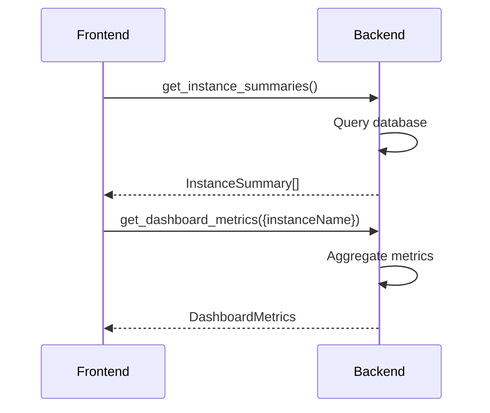

# Dashboard IPC Commands

## get_instance_summaries

**Description**: Retrieve all database instance summaries for dashboard display.

**Input**: None

**Output**: `InstanceSummary[]`

```typescript
// Frontend call
const summaries = await window.__TAURI__.invoke<InstanceSummary[]>('get_instance_summaries');

// Return type
interface InstanceSummary {
    instance_name: string;
    status: 'Healthy' | 'Warning' | 'Critical' | 'Unknown';
    health_score: number;  // 0-100
    active_issues: number;
    last_report_time?: string;  // ISO 8601
    report_count: number;
}
```

**Error Cases**:
- Database unavailable: `String` error message
- No instances found: Returns empty array

---

## get_dashboard_metrics

**Description**: Retrieve dashboard metrics and trend data, optionally filtered by instance.

**Input**:
```typescript
{
    instanceName?: string;  // Optional: filter by specific instance
}
```

**Output**: `DashboardMetrics`

```typescript
interface DashboardMetrics {
    instance_name?: string;
    cpu_usage_percent: number;
    memory_usage_percent: number;
    tps: number;  // Transactions per second
    qps: number;  // Queries per second
    trend_data: TrendPoint[];
    hot_issues: HotIssue[];
    recent_reports: WdrReportSummary[];
}

interface TrendPoint {
    timestamp: string;  // ISO 8601
    cpu: number;
    memory: number;
    tps: number;
    qps: number;
}

interface HotIssue {
    title: string;
    count: number;
    severity: 'Critical' | 'High' | 'Medium' | 'Low' | 'Info';
    category: 'Sql' | 'Wait' | 'Object' | 'System';
}

interface WdrReportSummary {
    id: number;
    instance_name: string;
    generation_time: string;  // ISO 8601
    snapshot_start: string;  // ISO 8601
    snapshot_end: string;  // ISO 8601
    status: 'SuccessfullyImported' | 'ImportFailed' | 'PartiallyImported';
}
```

**Error Cases**:
- Instance not found: `String` error message
- Database error: `String` error message
- Invalid instance name: `String` error message

**Performance**: Must complete within 1 second for standard data volumes.

---

## get_instance_health

**Description**: Calculate and return health score for a specific instance.

**Input**:
```typescript
{
    instanceName: string;
}
```

**Output**: `InstanceHealth`

```typescript
interface InstanceHealth {
    instance_name: string;
    overall_score: number;  // 0-100
    cpu_score: number;      // 0-100
    memory_score: number;   // 0-100
    io_score: number;       // 0-100
    sql_performance_score: number;  // 0-100
    active_issues: AuditIssueSummary[];
    recommendations: string[];
}

interface AuditIssueSummary {
    issue_type: string;
    count: number;
    severity: 'Critical' | 'High' | 'Medium' | 'Low';
}
```

**Error Cases**:
- Instance not found: `String` error message
- No data available: `String` error message

---

## get_dashboard_config

**Description**: Retrieve dashboard configuration settings.

**Input**: None

**Output**: `DashboardConfig`

```typescript
interface DashboardConfig {
    refresh_interval_seconds: number;
    default_instance_filter?: string;
    chart_data_points: number;  // Max number of trend points to display
    show_archived_reports: boolean;
    theme: 'light' | 'dark' | 'auto';
}
```

**Error Cases**:
- Configuration not found: Returns default config

---

## update_dashboard_config

**Description**: Update dashboard configuration settings.

**Input**:
```typescript
{
    config: DashboardConfig;
}
```

**Output**: `void`

**Error Cases**:
- Invalid configuration: `String` error message
- Permission denied: `String` error message

**Audit**: This operation is logged to audit_logs table per Constitution Principle IX.

---

## Connection Flow



## Data Sources

- `InstanceSummary`: Aggregated from `wdr_reports` and `sql_audit_issues`
- `DashboardMetrics`: Calculated from `efficiency_metrics`, `load_profile`, `top_sqls`
- `TrendData`: Historical metrics from `wdr_reports` joined with metrics tables
- `HotIssues`: Derived from `sql_audit_issues` with status='Open'

## Caching

Dashboard commands may implement caching:
- Instance summaries: Cache for 30 seconds
- Dashboard metrics: Cache for 10 seconds
- Trend data: Cache for 5 minutes

Cache invalidation on:
- New WDR report import
- Threshold configuration update
- Audit issue status change
