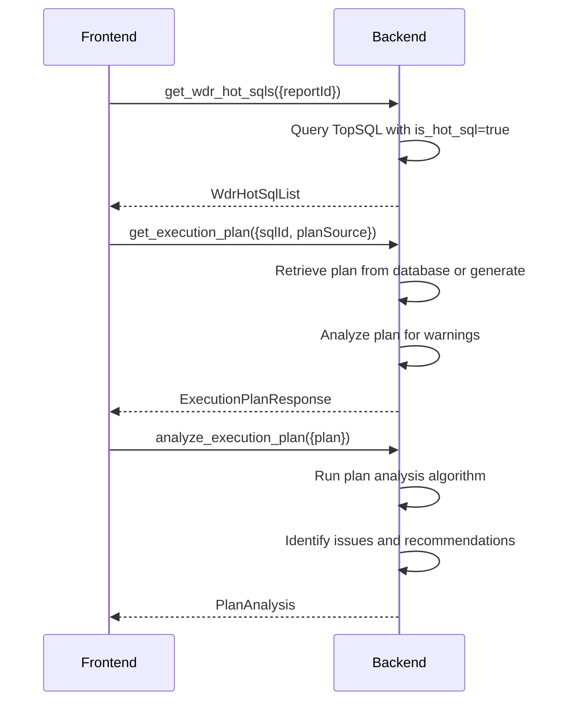

# Execution Plan IPC Commands

## get_wdr_hot_sqls

**Description**: Retrieve list of hot SQL queries from WDR reports for quick plan analysis.

**Input**:
```typescript
{
    reportId?: number;      // Optional: filter by specific report
    limit?: number;         // Maximum number of results
    sortBy?: 'elapsed_time' | 'cpu_time' | 'executions';
}
```

**Output**: `WdrHotSqlList`

```typescript
interface WdrHotSqlList {
    hot_sqls: WdrHotSql[];
    total: number;
}

interface WdrHotSql {
    id: number;
    report_id: number;
    sql_id?: string;
    sql_text: string;
    executions: number;
    total_elapsed_time: number;
    cpu_time: number;
    rank: number;
    instance_name: string;
    generation_time: string;
}
```

**Error Cases**:
- Database error: `String` error message
- No hot SQLs found: Returns empty array

---

## get_execution_plan

**Description**: Retrieve execution plan for a specific SQL query (from WDR or user-provided).

**Input**:
```typescript
{
    sqlId?: number;         // SQL ID from TopSQL table
    sqlText?: string;       // User-provided SQL text
    planSource: 'FromWdrReport' | 'UserProvided' | 'HotSql';
    reportId?: number;      // Required if source is FromWdrReport or HotSql
}
```

**Output**: `ExecutionPlanResponse`

```typescript
interface ExecutionPlanResponse {
    success: boolean;
    plan_tree: ExecutionPlanNode;
    plan_metadata: PlanMetadata;
    warnings: string[];
    suggestions: string[];
}

interface ExecutionPlanNode {
    operation: string;      // Operator type (Seq Scan, Hash Join, etc.)
    cost: number;           // Estimated cost
    rows: number;           // Estimated rows
    actual_rows?: number;   // Actual rows (from ANALYZE)
    actual_time?: number;   // Actual execution time (ms)
    width?: number;         // Row width in bytes
    children: ExecutionPlanNode[];  // Child nodes
    node_details: PlanNodeDetails;
    warnings: string[];     // Optimization warnings
    suggestions: string[];  // Optimization suggestions
}

interface PlanNodeDetails {
    output?: string[];      // Output columns
    filter?: string;        // Filter condition
    buffers?: string;       // Buffer usage
    join_type?: string;     // Join type (INNER, LEFT, etc.)
    hash_keys?: string[];   // Hash join keys
    index_name?: string;    // Index used (if any)
    table_name?: string;    // Table name
}

interface PlanMetadata {
    total_cost: number;
    total_rows: number;
    plan_depth: number;
    node_count: number;
    optimization_warnings: number;
    estimated_time_ms: number;
    gaussdb_format: boolean;
    has_actual_stats: boolean;  // From EXPLAIN ANALYZE
}
```

**Error Cases**:
- SQL not found: `String` error message (if sqlId provided)
- Invalid SQL syntax: `String` error message (if sqlText provided)
- Report not found: `String` error message
- Database connection error: `String` error message
- Plan parsing failed: `String` error message with details

**Performance**: Must complete within 2 seconds for plan retrieval and rendering.

---

## parse_execution_plan

**Description**: Parse raw execution plan text into structured tree format.

**Input**:
```typescript
{
    plan_text: string;
    format: 'text' | 'json';
    source: 'gaussdb' | 'postgresql' | 'oracle' | 'mysql';
}
```

**Output**: `ParsedPlan`

```typescript
interface ParsedPlan {
    success: boolean;
    plan_tree: ExecutionPlanNode;
    parse_warnings: string[];
    parsed_at: string;
}
```

**Error Cases**:
- Invalid plan format: `String` error message
- Parser error: `String` error message with line number
- Unsupported format: `String` error message

**Supported Formats**:
- GaussDB text format (default)
- GaussDB JSON format (FORMAT JSON)
- PostgreSQL text format (with adaptation)
- Generic tree format

---

## analyze_execution_plan

**Description**: Analyze execution plan for performance issues and optimization opportunities.

**Input**:
```typescript
{
    plan: ExecutionPlanNode;
    thresholds?: ThresholdOverrides;
}
```

**Output**: `PlanAnalysis`

```typescript
interface PlanAnalysis {
    score: number;              // 0-100 performance score
    issues: PlanIssue[];
    recommendations: PlanRecommendation[];
    optimization_potential: string;
    estimated_improvement?: number;
}

interface PlanIssue {
    node_path: string;          // Path to problematic node
    issue_type: IssueType;
    severity: 'Critical' | 'High' | 'Medium' | 'Low';
    description: string;
    affected_rows: number;
    cost_impact: number;
}

type IssueType =
    | 'FullTableScan'
    | 'MissingIndex'
    | 'InefficientJoin'
    | 'NestedLoopWithIndex'
    | 'HashJoinTooLarge'
    | 'SortOperation'
    | 'ExpensiveFunction'
    | 'CartesianProduct'
    | 'MissingStatistics';

interface PlanRecommendation {
    priority: 'Critical' | 'High' | 'Medium';
    action: string;
    description: string;
    sql_example?: string;
    estimated_benefit: string;
}
```

**Error Cases**:
- Invalid plan tree: `String` error message
- Analysis timeout: `String` error message

---

## save_execution_plan

**Description**: Save an execution plan for future reference.

**Input**:
```typescript
{
    sql_id?: number;            // Associated SQL (optional)
    sql_text?: string;          // SQL text (for user-provided plans)
    plan_tree: ExecutionPlanNode;
    plan_source: 'FromWdrReport' | 'UserProvided' | 'HotSql';
    report_id?: number;         // Required if source is FromWdrReport or HotSql
    name?: string;              // Optional name for user plans
}
```

**Output**: `SavePlanResult`

```typescript
interface SavePlanResult {
    success: boolean;
    plan_id: number;
    message?: string;
}
```

**Error Cases**:
- Invalid plan data: `String` error message
- Database error: `String` error message
- Permission denied: `String` error message

**Audit**: This operation is logged to audit_logs table per Constitution Principle IX.

---

## get_saved_plans

**Description**: Retrieve list of saved execution plans.

**Input**:
```typescript
{
    sql_id?: number;            // Filter by SQL
    report_id?: number;         // Filter by report
    limit?: number;
    offset?: number;
}
```

**Output**: `SavedPlansResponse`

```typescript
interface SavedPlansResponse {
    plans: SavedPlan[];
    total: number;
}

interface SavedPlan {
    id: number;
    sql_id?: number;
    sql_text?: string;
    source: string;
    created_at: string;
    total_cost: number;
    node_count: number;
    name?: string;
}
```

**Error Cases**:
- Database error: `String` error message

---

## delete_execution_plan

**Description**: Delete a saved execution plan.

**Input**:
```typescript
{
    plan_id: number;
    confirm: boolean;
}
```

**Output**: `DeleteResult`

```typescript
interface DeleteResult {
    success: boolean;
    deleted_plan_id: number;
    message?: string;
}
```

**Error Cases**:
- Plan not found: `String` error message
- Confirmation required: `String` error message
- Database error: `String` error message

---

## generate_optimization_sql

**Description**: Generate optimization SQL based on plan analysis (e.g., CREATE INDEX statements).

**Input**:
```typescript
{
    plan_id: number;
    optimization_type: 'index' | 'statistics' | 'rewrite';
}
```

**Output**: `OptimizationSql`

```typescript
interface OptimizationSql {
    sql_statements: string[];
    explanations: string[];
    warnings: string[];
    confidence: 'High' | 'Medium' | 'Low';
}
```

**Error Cases**:
- Plan not found: `String` error message
- No optimization available: `String` error message
- Database error: `String` error message

**Generated SQL Examples**:
- `CREATE INDEX idx_table_column ON table(column);`
- `ANALYZE table;`
- `REINDEX INDEX index_name;`

---

## Connection Flow



## GaussDB Compatibility

Per Constitution Principle V, all plan processing must be GaussDB-compatible:

### Supported GaussDB EXPLAIN Formats

1. **TEXT Format** (default):
```sql
EXPLAIN SELECT * FROM table1 t1 JOIN table2 t2 ON t1.id = t2.id;
```

2. **JSON Format**:
```sql
EXPLAIN (FORMAT JSON) SELECT * FROM table1 t1 JOIN table2 t2 ON t1.id = t2.id;
```

3. **ANALYZE Format**:
```sql
EXPLAIN ANALYZE SELECT * FROM table1 t1 JOIN table2 t2 ON t1.id = t2.id;
```

### enable_hypo_index Simulation

Per Constitution Principle V, virtual index evaluation:

```rust
// Backend simulates enable_hypo_index behavior
async fn simulate_virtual_index(sql: &str) -> Result<PlanComparison, String> {
    // 1. Get baseline plan
    let baseline_plan = execute_explain(&sql).await?;

    // 2. Hypothesize index creation
    let suggested_indexes = analyze_for_missing_indexes(&baseline_plan)?;

    // 3. Simulate index impact
    let improved_plan = simulate_plan_with_indexes(&sql, &suggested_indexes)?;

    // 4. Compare plans
    Ok(compare_plans(baseline_plan, improved_plan))
}
```

### GaussDB-Specific Features

**Supported Operators**:
- Data Node Scan
- Streaming
- Hash
- Broadcast
- Redistribution
- Single Slice
- All Slices

**Known Limitations**:
- Some distributed operators may not have cost estimates
- Multi-node plans show additional node information
- Distributed SQL may have different plan structure

## Performance Optimization

Per Constitution Principle VII:

### Async Loading
- Complex plan trees must NOT use synchronous traversal
- Child nodes load asynchronously when expanded
- Progressive rendering for large plans (>100 nodes)

### Virtual DOM Limitations
- Limit virtual DOM usage in plan visualization
- Use efficient tree rendering algorithms
- Implement node virtualization for large plans

### Performance Budgets
- Plan retrieval: < 2 seconds
- Plan analysis: < 1 second
- Plan rendering: < 1 second initial, < 100ms per expand
- Memory usage: < 100MB for typical plan

### Caching Strategy
```rust
// Cache frequently accessed plans
let cache_key = format!("plan:{}:{}", sql_hash, database_version);
let cached_plan = plan_cache.get(&cache_key)?;

// Invalidate on:
// - Database schema changes
// - Index creation/deletion
// - Statistics updates
```

## Error Handling

**Plan Parsing Errors**:
- Malformed plan text: Include line number and context
- Unsupported operator: Provide fallback rendering
- Version mismatch: Attempt auto-detection and adaptation

**Database Connection Errors**:
- Connection timeout: Return cached plan if available
- Authentication failed: Clear error message
- Network error: Retry with exponential backoff

**Analysis Errors**:
- Complex plan timeout: Return partial analysis
- Out of memory: Fall back to simplified analysis
- Invalid thresholds: Use defaults from configuration

## Frontend Integration

**Plan Visualization Requirements** (Constitution Principle VIII):
- Layout: Flexbox with left SQL editor (30%) and right tree view (50%)
- Menu bar: Must include "导入/导出PNG" (Import/Export PNG)
- Async node loading: Click to expand child nodes
- High-cost node highlighting: Cost > threshold with warning colors

**Hot SQL Integration** (Constitution Principle VI):
- Hot SQL clicks automatically trigger execution plan view
- Zero manual data transfer between WDR and plan views
- Threshold alerts: Rows Scanned > 1e6 triggers full table scan warning
