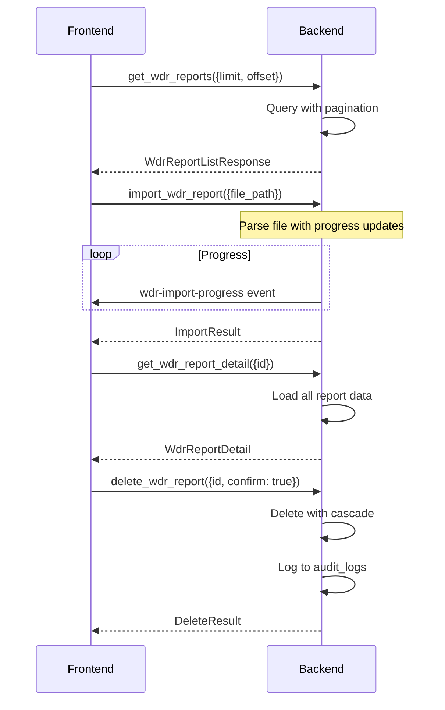

# WDR Report Management IPC Commands

## get_wdr_reports

**Description**: Retrieve all WDR reports with optional filtering and pagination.

**Input**:
```typescript
{
    instanceName?: string;      // Filter by instance
    status?: ReportStatus;      // Filter by status
    limit?: number;             // Maximum number of results
    offset?: number;            // Offset for pagination
    sortBy?: 'generation_time' | 'instance_name' | 'created_at';
    sortOrder?: 'asc' | 'desc';
}
```

**Output**: `WdrReportListResponse`

```typescript
interface WdrReportListResponse {
    reports: WdrReport[];
    total: number;
    has_more: boolean;
}

interface WdrReport {
    id: number;
    instance_name: string;
    generation_time: string;  // ISO 8601
    snapshot_start: string;   // ISO 8601
    snapshot_end: string;     // ISO 8601
    file_path?: string;
    file_size?: number;
    status: 'SuccessfullyImported' | 'ImportFailed' | 'PartiallyImported';
    created_at: string;       // ISO 8601
}
```

**Error Cases**:
- Database error: `String` error message
- Invalid parameters: `String` error message

**Performance**: Must handle 10,000+ reports efficiently with pagination.

---

## get_wdr_report_detail

**Description**: Retrieve complete details for a specific WDR report.

**Input**:
```typescript
{
    id: number;  // Report ID
}
```

**Output**: `WdrReportDetail`

```typescript
interface WdrReportDetail {
    // Metadata
    id: number;
    instance_name: string;
    generation_time: string;
    snapshot_start: string;
    snapshot_end: string;
    status: string;

    // Efficiency metrics
    efficiency: EfficiencyMetrics;

    // Load profile
    load_profile: LoadProfile;

    // Top SQL statistics
    top_sql: TopSql[];

    // Object statistics
    object_stats: ObjectStats[];
}

interface EfficiencyMetrics {
    buffer_hit_percent: number;
    cpu_efficiency_percent: number;
    soft_parse_rate_percent: number;
    hard_parse_rate_percent: number;
    execution_efficiency_percent: number;
}

interface LoadProfile {
    db_time_per_sec: number;
    cpu_time_per_sec: number;
    io_requests_per_sec: number;
    total_transactions: number;
    commits_per_sec: number;
    rollbacks_per_sec: number;
}

interface TopSql {
    id: number;
    sql_id?: string;
    sql_text: string;
    executions: number;
    total_elapsed_time: number;
    cpu_time: number;
    io_time: number;
    buffer_gets: number;
    disk_reads: number;
    rows_processed: number;
    rank_by_time?: number;
}

interface ObjectStats {
    id: number;
    schema_name: string;
    object_name: string;
    object_type: 'Table' | 'Index' | 'View' | 'Sequence';
    total_scans: number;
    seq_scans: number;
    idx_scans: number;
    seq_reads: number;
    idx_reads: number;
    inserts: number;
    updates: number;
    deletes: number;
    dead_tuples: number;
    needs_vacuum: boolean;
}
```

**Error Cases**:
- Report not found: `String` error message
- Database error: `String` error message
- Partial import: Warning included in response

**Performance**: Must complete within 2 seconds for typical reports.

---

## delete_wdr_report

**Description**: Delete a WDR report and all associated data.

**Input**:
```typescript
{
    id: number;
    confirm: boolean;  // Must be true to actually delete
}
```

**Output**: `DeleteResult`

```typescript
interface DeleteResult {
    success: boolean;
    deleted_report_id: number;
    deleted_sql_count: number;
    deleted_object_stats_count: number;
    message?: string;
}
```

**Error Cases**:
- Report not found: `String` error message
- Confirmation required: `String` error message (if confirm=false)
- Database error: `String` error message
- Permission denied: `String` error message

**Audit**: This operation is logged to audit_logs table per Constitution Principle IX.

**Side Effects**:
- Deletes from tables: `wdr_reports`, `efficiency_metrics`, `load_profile`, `top_sqls`, `object_stats`, `execution_plans`, `sql_audit_issues`
- Cascading deletes handled by foreign key constraints

---

## import_wdr_report

**Description**: Import a WDR report file (HTML or raw format) with progress tracking.

**Input**:
```typescript
{
    file_path: string;
    instance_name?: string;  // Override instance name from file
}
```

**Output**: `ImportResult`

```typescript
interface ImportResult {
    success: boolean;
    report_id?: number;
    message: string;
    warnings?: string[];
    parsed_sql_count?: number;
    parsed_metrics_count?: number;
}
```

**Error Cases**:
- File not found: `String` error message
- Invalid file format: `String` error message
- File too large (>100MB): `String` error message
- Malformed file: `String` error message with line number
- Database error: `String` error message

**Progress**: Progress updates sent via `window.emit('wdr-import-progress', {progress: number, stage: string})`

**Performance**:
- 50MB file: Complete within 30 seconds
- Streaming parser to handle large files
- Progress updates every 2 seconds

**File Formats Supported**:
1. **HTML WDR Reports**: Parse with `scraper` crate
2. **Raw WDR Files**: Parse with custom `nom` parser

---

## export_wdr_report

**Description**: Export a WDR report and its data to a file.

**Input**:
```typescript
{
    report_id: number;
    export_path: string;
    format: 'json' | 'csv' | 'pdf';
    include_sql: boolean;
    include_plans: boolean;
}
```

**Output**: `ExportResult`

```typescript
interface ExportResult {
    success: boolean;
    export_path: string;
    file_size: number;
    message?: string;
}
```

**Error Cases**:
- Report not found: `String` error message
- Invalid export path: `String` error message
- Disk space insufficient: `String` error message
- Permission denied: `String` error message

**Export Formats**:
- **JSON**: Complete report data in structured format
- **CSV**: Summary metrics only
- **PDF**: Formatted report for human reading

---

## get_wdr_report_summary

**Description**: Get a quick summary of a WDR report for listing views.

**Input**:
```typescript
{
    id: number;
}
```

**Output**: `WdrReportSummary`

```typescript
interface WdrReportSummary {
    id: number;
    instance_name: string;
    generation_time: string;
    snapshot_start: string;
    snapshot_end: string;
    status: string;
    total_sql_count: number;
    hot_sql_count: number;
    object_count: number;
    performance_score?: number;
}
```

**Error Cases**:
- Report not found: `String` error message

**Performance**: Must complete within 100ms (lightweight query).

---

## Connection Flow



## Data Validation

**Import Validation**:
- File must exist and be readable
- File size must be >0 and <100MB
- File format must be HTML or proprietary WDR raw format
- Instance name must be valid (non-empty, <100 chars)
- Snapshot period must be valid (start < end)

**Delete Validation**:
- Report must exist
- User must confirm deletion
- No pending exports using this report

**Export Validation**:
- Report must exist
- Export path must be writable
- Format must be one of: json, csv, pdf

## Error Handling

All commands return `Result<T, String>` in Rust backend:
- `Ok(T)`: Successful operation with result
- `Err(String)`: Error message to display to user

Frontend should:
- Display error messages using ElMessage (per Constitution)
- Log errors to console for debugging
- Provide retry mechanism for transient errors
- Show progress indicators for long operations

## Performance Considerations

**Indexing Strategy**:
```sql
-- Critical indexes for report queries
CREATE INDEX idx_wdr_reports_instance ON wdr_reports(instance_name);
CREATE INDEX idx_wdr_reports_gen_time ON wdr_reports(generation_time);
CREATE INDEX idx_wdr_reports_status ON wdr_reports(status);
CREATE INDEX idx_top_sqls_report_id ON top_sqls(report_id);
CREATE INDEX idx_top_sqls_hot_sql ON top_sqls(is_hot_sql);
```

**Query Optimization**:
- Use LIMIT/OFFSET for pagination
- Cache frequently accessed reports
- Lazy load execution plans (only when requested)
- Use COUNT(*) with SQLITE_OMIT_COUNT for pagination counts

**Memory Management**:
- Stream large file imports
- Paginate SQL list in report details
- Use memmap2 for large file processing
- Clean up temporary data after operations
