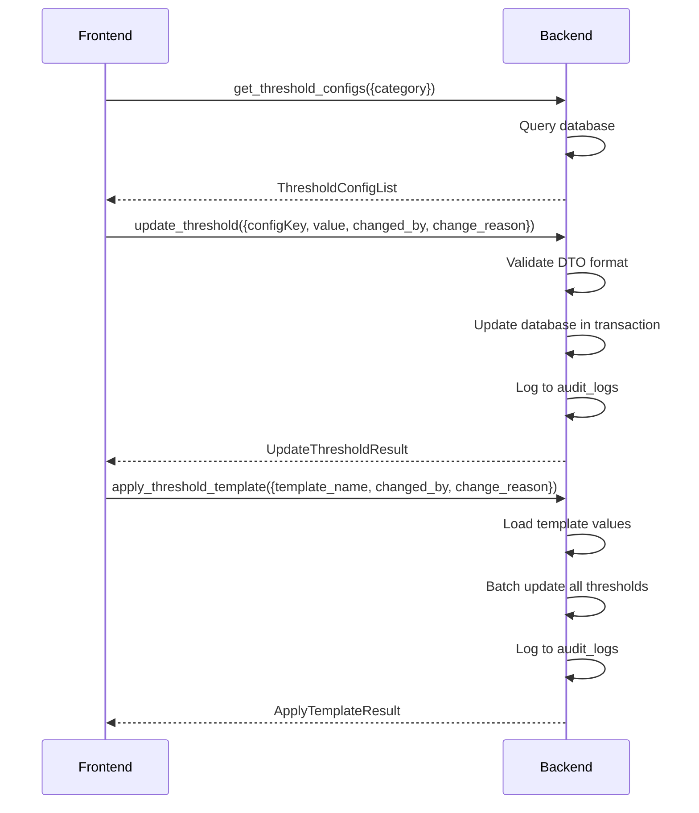

# Threshold Configuration IPC Commands

Per Constitution Principle IV, all threshold management must use DTO format with audit trail.

## get_threshold_configs

**Description**: Retrieve all threshold configurations, optionally filtered by category.

**Input**:
```typescript
{
    category?: 'Sql' | 'Wait' | 'System' | 'AI';
}
```

**Output**: `ThresholdConfigList`

```typescript
interface ThresholdConfigList {
    thresholds: ThresholdConfig[];
    total: number;
}

interface ThresholdConfig {
    id: number;
    category: 'Sql' | 'Wait' | 'System' | 'AI';
    data_type: 'Float' | 'Integer' | 'Percentage';
    config_key: string;
    value: number;
    default_value: number;
    min_value?: number;
    max_value?: number;
    description?: string;
    updated_at: string;  // ISO 8601
    updated_by?: string;
}
```

**Error Cases**:
- Database error: `String` error message

**Note**: Returns default values if no custom thresholds configured.

---

## get_threshold_config

**Description**: Retrieve a specific threshold configuration by key.

**Input**:
```typescript
{
    configKey: string;
}
```

**Output**: `ThresholdConfig`

**Error Cases**:
- Threshold not found: `String` error message
- Database error: `String` error message

---

## update_threshold

**Description**: Update a single threshold value per Constitution DTO format.

**Input** (Constitution IV compliant):
```typescript
{
    configKey: string;
    value: number;
    changed_by: string;
    change_reason: string;
}
```

**Output**: `UpdateThresholdResult`

```typescript
interface UpdateThresholdResult {
    success: boolean;
    threshold_id: number;
    old_value: number;
    new_value: number;
    updated_at: string;
    message?: string;
}
```

**Error Cases**:
- Threshold not found: `String` error message
- Invalid value (outside min/max): `String` error message
- Missing change_reason: `String` error message
- Database error: `String` error message

**Validation**:
- `changed_by` must be non-empty
- `change_reason` must be non-empty and <500 characters
- Value must be within min/max bounds (if defined)
- Value must be non-negative

**Audit**: This operation is **mandatorily** logged to audit_logs table per Constitution Principle IX.

**DTO Format Compliance**:
```rust
// Backend validates DTO format
fn validate_threshold_update(request: &ThresholdUpdateRequest) -> Result<(), String> {
    if request.changed_by.is_empty() {
        return Err("changed_by is required".to_string());
    }
    if request.change_reason.is_empty() {
        return Err("change_reason is required".to_string());
    }
    if request.change_reason.len() > 500 {
        return Err("change_reason too long (max 500 chars)".to_string());
    }
    Ok(())
}
```

---

## batch_update_thresholds

**Description**: Update multiple thresholds in a single transaction.

**Input**:
```typescript
{
    updates: ThresholdUpdate[];
    changed_by: string;
    change_reason: string;
}

interface ThresholdUpdate {
    config_key: string;
    value: number;
}
```

**Output**: `BatchUpdateResult`

```typescript
interface BatchUpdateResult {
    success: boolean;
    updated_count: number;
    failed_updates: FailedUpdate[];
    message?: string;
}

interface FailedUpdate {
    config_key: string;
    error: string;
}
```

**Error Cases**:
- No updates provided: `String` error message
- Invalid threshold key: `String` error message
- Invalid value: `String` error message
- Database error: `String` error message

**Transaction Behavior**:
- All updates succeed or all fail
- Partial updates rolled back on error
- Atomic operation

**Audit**: Single audit log entry for entire batch with update count.

---

## reset_threshold_to_default

**Description**: Reset a threshold to its default value.

**Input**:
```typescript
{
    configKey: string;
    changed_by: string;
    change_reason: string;
}
```

**Output**: `ResetThresholdResult`

```typescript
interface ResetThresholdResult {
    success: boolean;
    threshold_id: number;
    reset_to_value: number;
    message?: string;
}
```

**Error Cases**:
- Threshold not found: `String` error message
- Database error: `String` error message

**Audit**: Logged to audit_logs with action='Reset'.

---

## get_threshold_templates

**Description**: Retrieve available threshold templates.

**Input**: None

**Output**: `ThresholdTemplateList`

```typescript
interface ThresholdTemplateList {
    templates: ThresholdTemplate[];
}

interface ThresholdTemplate {
    name: string;
    description: string;
    category: 'Sql' | 'Wait' | 'System' | 'AI' | 'All';
    thresholds: TemplateThreshold[];
}

interface TemplateThreshold {
    config_key: string;
    value: number;
    description?: string;
}
```

**Built-in Templates**:
1. **"High Concurrency"**: Optimized for high-traffic databases
2. **"Low Resource"**: Optimized for resource-constrained environments
3. **"Development"**: Relaxed thresholds for development
4. **"Production"**: Strict thresholds for production systems
5. **"GaussDB Optimized"**: Tuned specifically for GaussDB

---

## apply_threshold_template

**Description**: Apply a template to set multiple threshold values at once.

**Input**:
```typescript
{
    template_name: string;
    changed_by: string;
    change_reason: string;
}
```

**Output**: `ApplyTemplateResult`

```typescript
interface ApplyTemplateResult {
    success: boolean;
    template_name: string;
    updated_count: number;
    message?: string;
}
```

**Error Cases**:
- Template not found: `String` error message
- Database error: `String` error message

**Audit**: Single audit log entry for template application.

---

## get_threshold_history

**Description**: Retrieve change history for a specific threshold.

**Input**:
```typescript
{
    configKey: string;
    limit?: number;
}
```

**Output**: `ThresholdHistory`

```typescript
interface ThresholdHistory {
    config_key: string;
    history: ThresholdChange[];
}

interface ThresholdChange {
    old_value: number;
    new_value: number;
    changed_by: string;
    change_reason: string;
    timestamp: string;
}
```

**Error Cases**:
- Threshold not found: `String` error message
- Database error: `String` error message

---

## validate_threshold_value

**Description**: Validate a threshold value without updating.

**Input**:
```typescript
{
    configKey: string;
    value: number;
}
```

**Output**: `ValidationResult`

```typescript
interface ValidationResult {
    valid: boolean;
    message?: string;
    suggested_value?: number;
}
```

**Error Cases**: None (validation doesn't fail)

**Usage**: Frontend can call this before updating to provide immediate feedback.

---

## Connection Flow



## DTO Format Specification

Per Constitution Principle IV, all threshold operations must use this exact format:

### ThresholdUpdateRequest
```typescript
{
    value: number,           // New threshold value
    changed_by: string,      // User making the change
    change_reason: string    // Explanation for the change
}
```

### Required Fields
- `changed_by`: Non-empty string, identifies the user
- `change_reason`: Non-empty string, <500 characters, explains why
- `value`: Numeric value within configured bounds

### Audit Trail Requirements
Every threshold change must record:
```sql
INSERT INTO audit_logs (
    action, entity_type, entity_id, old_value, new_value,
    user_id, timestamp, details
) VALUES (
    'ThresholdUpdate', 'threshold', threshold_id, old_value, new_value,
    changed_by, CURRENT_TIMESTAMP, change_reason
);
```

## Default Threshold Values

### SQL Category
```typescript
{
    'sql_execution_time_ms': { default: 1000, min: 0, max: 60000 },
    'sql_cpu_time_ms': { default: 500, min: 0, max: 60000 },
    'sql_buffer_gets': { default: 10000, min: 0, max: 100000000 },
    'sql_disk_reads': { default: 1000, min: 0, max: 10000000 },
    'sql_rows_scanned_threshold': { default: 1000000, min: 0, max: 10000000000 },
    'full_table_scan_cost': { default: 1000, min: 0, max: 100000 },
    'hot_sql_rank_threshold': { default: 10, min: 1, max: 1000 }
}
```

### Wait Category
```typescript
{
    'wait_time_ms': { default: 100, min: 0, max: 60000 },
    'lock_wait_timeout_ms': { default: 5000, min: 1000, max: 300000 },
    'deadlock_threshold': { default: 1, min: 0, max: 100 }
}
```

### System Category
```typescript
{
    'cpu_usage_percent': { default: 80, min: 0, max: 100 },
    'memory_usage_percent': { default: 85, min: 0, max: 100 },
    'disk_usage_percent': { default: 90, min: 0, max: 100 },
    'tps_threshold': { default: 1000, min: 0, max: 1000000 },
    'qps_threshold': { default: 5000, min: 0, max: 10000000 },
    'connection_count': { default: 100, min: 1, max: 10000 }
}
```

### AI Category
```typescript
{
    'ai_confidence_threshold': { default: 0.8, min: 0, max: 1 },
    'ai_recommendation_priority': { default: 0.5, min: 0, max: 1 },
    'ai_virtual_index_impact': { default: 0.1, min: 0, max: 1 }
}
```

## Validation Rules

### Value Validation
```rust
fn validate_threshold_value(
    config: &ThresholdConfig,
    value: f64
) -> Result<(), String> {
    // Check min/max bounds
    if let Some(min) = config.min_value {
        if value < min {
            return Err(format!("Value {} below minimum {}", value, min));
        }
    }

    if let Some(max) = config.max_value {
        if value > max {
            return Err(format!("Value {} above maximum {}", value, max));
        }
    }

    // Check non-negative
    if value < 0.0 {
        return Err("Value cannot be negative".to_string());
    }

    // Data type specific validation
    match config.data_type {
        ThresholdDataType::Integer => {
            if value.fract() != 0.0 {
                return Err("Value must be an integer".to_string());
            }
        }
        ThresholdDataType::Percentage => {
            if value > 100.0 {
                return Err("Percentage cannot exceed 100".to_string());
            }
        }
        _ => {} // Float allows any value
    }

    Ok(())
}
```

### Change Reason Validation
```rust
fn validate_change_reason(reason: &str) -> Result<(), String> {
    if reason.trim().is_empty() {
        return Err("Change reason is required".to_string());
    }

    if reason.len() > 500 {
        return Err("Change reason too long (max 500 characters)".to_string());
    }

    // Check for meaningful content
    if reason.trim().len() < 10 {
        return Err("Change reason too short (min 10 characters)".to_string());
    }

    Ok(())
}
```

## Performance Considerations

### Database Optimization
```sql
-- Index for fast lookups
CREATE INDEX idx_threshold_configs_category ON threshold_configs(category);
CREATE INDEX idx_threshold_configs_key ON threshold_configs(config_key);

-- Index for audit queries
CREATE INDEX idx_audit_logs_threshold ON audit_logs(entity_type, entity_id);
CREATE INDEX idx_audit_logs_timestamp ON audit_logs(timestamp);
```

### Caching Strategy
- Cache threshold configs in memory
- Invalidate cache on updates
- Default to database if cache miss
- Cache TTL: 60 seconds

### Batch Operations
- Use transactions for batch updates
- Prepare statements for multiple updates
- Log single audit entry for batch
- Return detailed results for each update

## Error Handling

**Common Errors**:
- Threshold not found: Return 404-like error message
- Invalid value: Include valid range in error
- Database locked: Retry with backoff
- Audit logging failed: Log error but still update threshold

**User Feedback**:
- Use ElMessage for all user-facing errors (Constitution)
- Provide helpful validation messages
- Show previous value in error context
- Suggest valid value ranges
